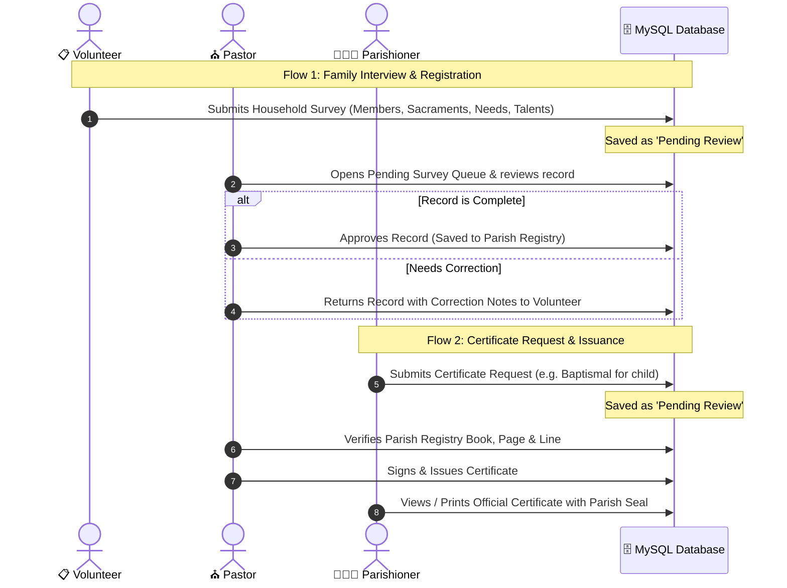

# San Isidro Labrador Parish Information System
## System Documentation & Presentation Guide

---

### 1. Overview: What is this system?

This is a **Parish Family, BEC (Basic Ecclesial Community), and Pastoral Mission Information System**. 

Unlike a conventional static census or basic donation tracker, this system is designed around a living pastoral structure:
- **Family as Focus:** Records families and individuals, their sacramental milestones, and immediate needs.
- **BEC as Locus (Grassroots):** Groups households into local neighborhood clusters (*Puroks / Sitios / BECs*) so the church knows which areas are active or need outreach.
- **Synodality & Stewardship as Modus:** Collects both **Needs** (e.g. sick elderly, unbaptized infants) and **Gifts** (e.g. parishioners who are teachers, nurses, musicians, or carpenters willing to volunteer).
- **Mission as Direction:** Provides data directly to the Parish Priest and the **Three Parish Commissions** (*Worship, Evangelization, Social Services*) to guide pastoral programs.

---

### 2. The 3 Core Users (+ Parish Council)

| User Role | Main Responsibilities | What they can see & do |
| :--- | :--- | :--- |
| **1. Pastor** *(Parish Priest)* | Sole Authority & Approver | • Reviews field surveys submitted by volunteers.<br>• Approves surveys into the permanent parish registry or returns them for correction.<br>• Sole authority to sign and issue official sacramental certificates (Baptismal, Confirmation).<br>• Accesses full parish records and reports. |
| **2. Volunteer** *(Field Data Encoder)* | Field Survey & Encoding | • Assigned to barangays, sitios, and BECs.<br>• Conducts face-to-face family interviews using the 4-step survey form.<br>• Encodes family details, members, sacraments, and pastoral listening notes.<br>• Submits records to the Pastor and follows up on corrections. |
| **3. Parishioner / Parent** | Household Self-Service | • Views verified details of their own household and registered family members.<br>• Submits certificate requests (e.g., Baptismal certificate for school or wedding).<br>• Views and prints official issued certificates.<br>• **Privacy Safeguard:** Cannot access or view records of families outside their household. |
| **4. Parish Council (PPC)** | Pastoral Planning & Leadership | • Views aggregated community statistics and charts.<br>• Identifies sacramental gaps, vulnerable households, and volunteer talents without exposing confidential family notes. |

---

### 3. Step-by-Step System Workflows



#### Workflow A: Volunteer Field Interview
1. The volunteer visits a family in their assigned barangay/sitio.
2. If the family agrees, **Informed Consent** is noted.
3. The volunteer encodes:
   - **Household Identification:** Address, Barangay, Sitio/Purok, BEC cluster, and contact number.
   - **Family Members:** Full names, relationship, age, and sacramental flags (Baptized, First Communion, Confirmed, Church Married).
   - **Needs & Gifts:** Pastoral visits requested, homebound status, and talents the family can share.
   - **Listening Section:** The family's main blessings and difficulties.
4. The volunteer submits the record. It enters the **Pending Review** queue.

#### Workflow B: Pastor Pastoral Intelligence & Survey Review
1. **Executive Reports & Discernment:** The Pastor's primary dashboard provides actionable reports synthesized directly from the filled-up survey forms:
   - **Sacramental Readiness:** Baptism backlog (infants vs youth/adults), First Communion candidates (7+), Confirmation backlog (12+), and couples for marriage regularization (*Kasalang Bayan*).
   - **Sick & Homebound Visit Sheet:** Specific roster of bedridden, elderly, and sick parishioners with exact addresses and contacts for First Friday sick calls.
   - **Grassroots Evangelization:** Sunday Mass attendance frequency and BEC gathering rates across all clusters and sitios.
   - **Stewardship Charisms Directory:** Parishioners categorized by talents they offered (Catechists, Choir/Music, Medical/First Aid, Carpentry/Facilities, BEC Leaders, Youth Mentors).
   - **Actionable Rosters:** Clicking any card opens a printable, searchable roster sheet.
2. **Pending Survey Review:** The Pastor opens the **Pending Surveys** tab.
3. Clicking **Review Details** displays the complete survey.
4. The Pastor has two choices:
   - **Approve & Save Record:** The family is officially accepted into the Parish Master Registry.
   - **Return to Volunteer for Correction:** The Pastor types a note (e.g., *"Please confirm birthdate and baptism venue of 2nd child"*). The status updates to `Returned for Correction`, alerting the volunteer.

#### Workflow C: Certificate Request & Issuance
1. The **Parishioner** logs into their portal and sees their verified family members.
2. The parishioner clicks **Request Certificate**, selects the family member, and specifies the purpose (e.g. *School Enrollment*).
3. The **Pastor** receives the request, locates the physical church register, inputs the **Book Number, Page Number, Line Number, and Sponsors (Godparents)**, and clicks **Sign & Issue**.
4. The certificate becomes immediately available in the parishioner's portal for viewing or printing.

---

### 4. Built-in Security & Privacy Rules

1. **Family Relationship Privacy Check (from Flowchart FC_MEMBER):**
   - Parishioners are strictly restricted to viewing certificates belonging to their verified household members. 
   - Trying to query or access records outside their family results in an explicit:
     > *"Access Denied: You may only view certificates for members of your registered household."*

2. **Informed Consent Requirement:**
   - A volunteer cannot submit a household profile without checking the consent confirmation.

3. **Sole Issuing Authority:**
   - Only the Pastor account has permission to sign and issue sacramental certificates.

---

### 5. Database Architecture (MySQL)

| Table | Description | Key Columns |
| :--- | :--- | :--- |
| `users` | User accounts for authentication and access control. | `name`, `email`, `password`, `role` (pastor, volunteer, parishioner), `household_id` |
| `households` | Core family unit records. | `family_code`, `family_name`, `head_name`, `address`, `barangay`, `sitio_purok`, `bec_cluster`, `status`, `pastoral_needs`, `volunteer_skills`, `consent_given` |
| `family_members` | Individual persons within each family. | `household_id`, `full_name`, `relationship`, `age`, `is_baptized`, `is_first_communion`, `is_confirmed`, `is_church_married`, `is_homebound` |
| `certificates` | Sacramental records and official certificates. | `certificate_code`, `household_id`, `family_member_id`, `recipient_name`, `certificate_type`, `status`, `book_no`, `page_no`, `line_no`, `sponsor_names`, `issued_at` |

---

### 6. How to Run and Present the System

1. **Start the local server:**
   ```bash
   php artisan serve
   ```
2. **Open in browser:**
   ```
   http://localhost:8000
   ```
3. **Switch Roles using the top bar:**
   - Click **Volunteer** to demo how field surveys are encoded and submitted.
   - Click **Pastor** to demo how pending surveys are approved/returned and how certificates are issued.
   - Click **Family Member** to demo how parishioners view their family and download certificates.
   - Click **Parish Council (PPC)** to demo how aggregated pastoral indicators guide church ministries.

4. **Default Test Accounts (Seeded in Database):**
   - **Pastor:** `pastor@parish.org` (password: `password`)
   - **Volunteer:** `volunteer@parish.org` (password: `password`)
   - **Parishioner:** `member@parish.org` (password: `password`)
